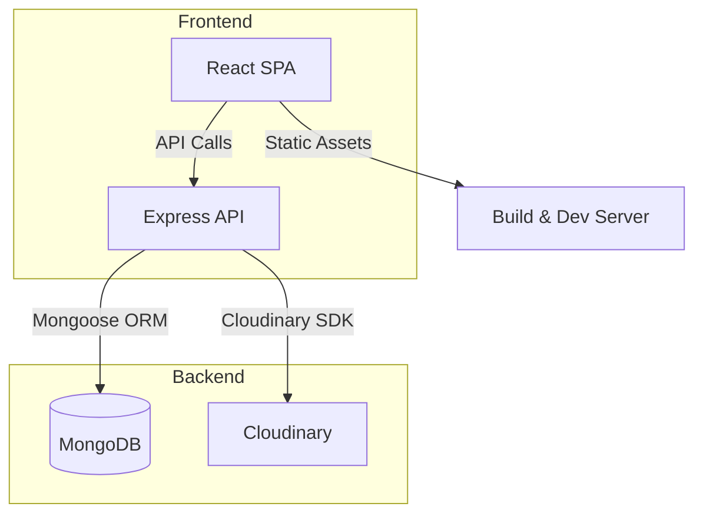

# Farmers-App

## Overview

**Farmers-App** is a full‑stack web application that connects farmers with customers to sell and purchase agricultural products. It provides a marketplace where farmers can list their crops, manage inventory, and handle orders, while customers can browse products, add items to a cart, and place orders. The system includes user authentication, address management, and integrates with Cloudinary for image handling.

> **Inferred from code analysis** – The overall purpose is derived from the naming of controllers, routes, and schemas.

---

## Features

| Feature | Purpose | Key Files | Dependencies |
|---|---|---|---|
| User Authentication | Register, login, logout, profile, password change | `Backend/src/Controller/AuthController.js`, `Backend/src/Routes/AuthRouter.js`, `Backend/src/service/AuthService.js` | bcrypt, jsonwebtoken, cookie-parser |
| User Management & Address Book | CRUD for user accounts and address handling | `Backend/src/Controller/UserController.js`, `Backend/src/Routes/UserRouter.js` | mongoose |
| Product Catalog | CRUD for products, listing, image upload via Cloudinary | `Backend/src/Controller/ProductController.js`, `Backend/src/Routes/ProductRouter.js`, `Backend/src/service/ProductService.js` | cloudinary |
| Farmer Crop Management | Farmers can add/update crops they grow | `Backend/src/Controller/FarmerCropController.js`, `Backend/src/Routes/FarmerCropRouter.js` | mongoose |
| Cart & Order Processing | Add to cart, view cart, place orders, order history | `Backend/src/Controller/CartController.js`, `Backend/src/Controller/OrderController.js`, `Backend/src/Routes/CartRouter.js`, `Backend/src/Routes/OrderRouter.js` | mongoose |
| Transaction Recording | Record payments and order transactions | `Backend/src/Schema/Transaction.js` | mongoose |
| Image Handling | Upload and store product images | `Backend/src/config/cloudinaryConfig.js` | cloudinary |
| API Documentation (Swagger not present) | RESTful JSON API for frontend consumption | All `Backend/src/Routes/*.js` | express |

---

## Tech Stack

| Layer | Technology |
|---|---|
| Frontend | React 18, Vite 6, React Router 7, Axios, React Icons, React Toastify |
| Backend | Node.js, Express 4, MongoDB (via Mongoose), JWT, Bcrypt, Cloudinary |
| Database | MongoDB |
| Dev Tools | Nodemon, ESLint, Prettier |
| Package Managers | npm (both front & back) |

---

## Architecture



- The **frontend** is a single‑page application built with React and bundled by Vite.
- The **backend** is an Express server exposing RESTful endpoints, using Mongoose to interact with MongoDB.
- Authentication is handled via JWT stored in an HTTP‑only cookie.
- Images are uploaded to Cloudinary using the `cloudinaryConfig`.

---

## Project Structure

```
Farmers-App/
├─ .gitignore
├─ README.md
├─ Backend/
│  ├─ package.json
│  ├─ src/
│  │  ├─ index.js               # Entry point, server start
│  │  ├─ config/
│  │  │  ├─ ServerConfig.js       # Env variables (PORT, MONGODB_URL, JWT_SECRET, Cloudinary creds)
│  │  │  └─ cloudinaryConfig.js   # Cloudinary setup
│  │  ├─ Controller/
│  │  │  ├─ AuthController.js
│  │  │  ├─ CartController.js
│  │  │  ├─ FarmerCropController.js
│  │  │  ├─ OrderController.js
│  │  │  ├─ ProductController.js
│  │  │  └─ UserController.js
│  │  ├─ Routes/
│  │  │  ├─ AuthRouter.js
│  │  │  ├─ CartRouter.js
│  │  │  ├─ FarmerCropRouter.js
│  │  │  ├─ OrderRouter.js
│  │  │  ├─ ProductRouter.js
│  │  │  └─ UserRouter.js
│  │  ├─ Repository/
│  │  │  ├─ CartRepository.js
│  │  │  ├─ FarmerCropRepository.js
│  │  │  ├─ OrderRepository.js
│  │  │  ├─ ProductRepository.js
│  │  │  └─ UserRepository.js
│  │  ├─ Schema/
│  │  │  ├─ Cart.js
│  │  │  ├─ FarmerCrop.js
│  │  │  ├─ Order.js
│  │  │  ├─ Product.js
│  │  │  ├─ Transaction.js
│  │  │  └─ User.js
│  │  └─ service/ (business logic)
│  └─ ...
├─ Frontend/
│  ├─ package.json
│  ├─ vite.config.js
│  ├─ src/
│  │  ├─ main.jsx
│  │  ├─ App.jsx
│  │  ├─ Layout.jsx
│  │  ├─ components/ (Home, Products, Profile, Resuable_Comp, StarComp, etc.)
│  │  └─ styles/ (globals, utilities, animations, typography, variables)
│  └─ dist/ (built assets)
└─ ...
```

---

## Prerequisites

| Tool | Version |
|---|---|
| Node.js | >= 20.x |
| npm | >= 10.x |
| MongoDB | 6.x (or Atlas) |
| Cloudinary account | – (required for image upload) |
| Git | – |

---

## Installation

```bash
# Clone the repo
git clone https://github.com/ankit20500/Farmers-App.git
cd Farmers-App

# Backend setup
cd Backend
npm install
# Create a .env file (see below) and then start the server
npm run start

# Frontend setup (in another terminal)
cd ../Frontend
npm install
npm run dev
```

The backend will run on **PORT** defined in `.env` (default 5000) and the frontend dev server on **5173**.

---

## Environment Variables

| Variable | Required | Description | Example |
|---|---|---|---|
| PORT | Yes | Port for Express server | 5000 |
| MONGODB_URL | Yes | MongoDB connection string | mongodb://localhost:27017/farmersApp |
| JWT_SECRET | Yes | Secret key for signing JWTs | supersecret |
| CLOUDINARY_NAME | Yes | Cloudinary cloud name |
| CLOUDINARY_API_KEY | Yes | Cloudinary API key |
| CLOUDINARY_SECRET | Yes | Cloudinary API secret |
| NODE_ENV | No | `development` or `production` |

Create a **Backend/.env** file with the above keys (the repository already contains a placeholder `.env` ignored by git).

---

## Running Locally

1. Ensure MongoDB is running.
2. Start the backend (`npm run start`).
3. In a separate terminal, start the frontend (`npm run dev`).
4. Open `http://localhost:5173` in a browser.

---

## Build Process

```bash
# Frontend production build
cd Frontend
npm run build   # outputs to ./dist
```

The build creates optimized static assets that can be served by any static web server or integrated into the Express backend.

---

## Database Setup

- Install MongoDB locally or use a cloud provider (MongoDB Atlas).
- The application will automatically create collections **users**, **products**, **carts**, **orders**, **farmercrops**, **transactions** on first use.
- No manual migrations are present; schema definitions are in `Backend/src/Schema/*.js`.

---

## API Documentation

| Method | Endpoint | Auth | Description |
|---|---|---|---|
| POST | `/api/auth/register` | No | Register a new user |
| POST | `/api/auth/login` | No | Authenticate and receive JWT cookie |
| POST | `/api/auth/logout` | Yes | Clear auth cookie |
| GET | `/api/user/profile/:id` | Yes | Retrieve user profile |
| PUT | `/api/user/update` | Yes | Update user details |
| PUT | `/api/user/password/update` | Yes | Change password |
| GET | `/api/user/addresses` | Yes | List saved addresses |
| POST | `/api/user/addresses` | Yes | Add new address |
| PUT | `/api/user/addresses/:addressId` | Yes | Update address |
| DELETE | `/api/user/addresses/:addressId` | Yes | Delete address |
| PUT | `/api/user/addresses/:addressId/default` | Yes | Set default address |
| GET | `/api/products` | No | List all products |
| POST | `/api/products` | Yes | Create a new product (farmer) |
| PUT | `/api/products/:id` | Yes | Update product |
| DELETE | `/api/products/:id` | Yes | Delete product |
| GET | `/api/farmercrops` | No | List farmer crops |
| POST | `/api/farmercrops` | Yes | Add crop |
| PUT | `/api/farmercrops/:id` | Yes | Update crop |
| DELETE | `/api/farmercrops/:id` | Yes | Delete crop |
| GET | `/api/cart` | Yes | Get current user cart |
| POST | `/api/cart` | Yes | Add item to cart |
| PUT | `/api/cart/:itemId` | Yes | Update cart item quantity |
| DELETE | `/api/cart/:itemId` | Yes | Remove item from cart |
| POST | `/api/orders` | Yes | Create an order from cart |
| GET | `/api/orders/:id` | Yes | Get order details |

> **Inferred from code analysis** – Endpoints are derived from route file names and controller functions.

---

## Authentication & Authorization

- Users register with email/password.
- On login, a JWT is generated (`JWT_SECRET`) and stored in an **httpOnly** cookie named `authToken`.
- Middleware `isLoggedIn` (found in `Backend/src/validator/authValidator.js`) validates the token on protected routes.
- Passwords are hashed with **bcrypt**.
- Role‑based checks are not present; all authenticated users have the same permissions.

---

## Core Workflows

1. **User Registration & Login** – POST `/api/auth/register` → creates user, then POST `/api/auth/login` → receives JWT cookie.
2. **Product Management** – Authenticated farmer uses product CRUD endpoints to list crops for sale.
3. **Shopping Cart** – Items added via `/api/cart`; cart persisted in MongoDB linked to user ID.
4. **Order Placement** – POST `/api/orders` creates an order, moves items from cart to order, records a transaction.
5. **Address Book** – Users manage multiple addresses; a default address can be set.

---

## Module Breakdown

- **Controller** – Handles HTTP request/response, delegates to services.
- **Service** – Business logic, interacts with repositories.
- **Repository** – Direct database queries using Mongoose models.
- **Schema** – Mongoose schema definitions for each collection.
- **Routes** – Express routers grouping related endpoints, applying middleware.
- **Config** – Centralised configuration (`ServerConfig.js`, `cloudinaryConfig.js`).
- **Utility/Handler** – Generic helper functions (e.g., error handling).

---

## Scripts

| Location | Script | Command |
|---|---|---|
| Backend | `start` | `npx nodemon src/index.js` |
| Frontend | `dev` | `vite` |
| Frontend | `build` | `vite build` |
| Frontend | `lint` | `eslint .` |
| Frontend | `preview` | `vite preview` |

---

## Testing

> No automated test suite is present in the repository at this time.

To add tests, consider using **Jest** for backend unit tests and **React Testing Library** for frontend components.

---

## Deployment

1. **Backend** – Deploy to a Node.js host (e.g., Heroku, Render, Railway). Ensure environment variables are set in the platform.
2. **Frontend** – The Vite build outputs static files that can be served from any CDN or integrated into the Express app's `public` folder.
3. Set `NODE_ENV=production` to enable secure cookie flags.

---

## Future Improvements

- Add role‑based access control (farmer vs. customer).
- Implement pagination and search for product listings.
- Introduce automated testing and CI pipelines.
- Provide OpenAPI/Swagger documentation for the API.
- Add image optimisation pipelines.
- Refactor duplicate env‑var loading into a dedicated config loader.

---

*This README was generated automatically by analysing the entire codebase.*
